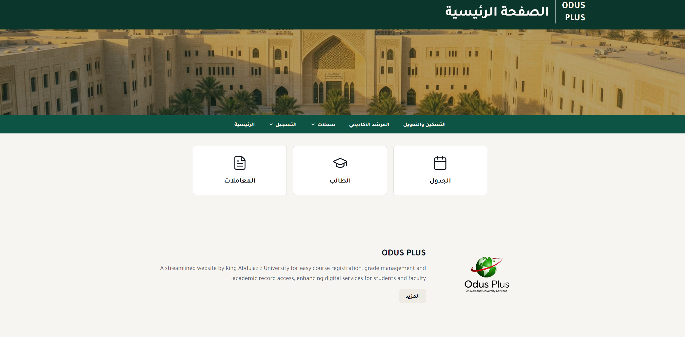
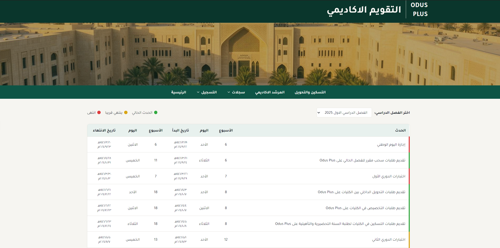
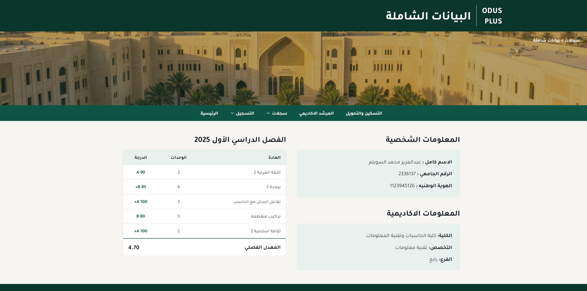

# ODUS Plus UI Redesign & Implementation

## Live Demo
👉 https://odusplus-v2.lovable.app

---

## Overview
This project is a redesigned and implemented frontend version of the ODUS Plus university system, focusing on improving usability, layout, and overall user experience.

The original ODUS system has navigation and usability challenges. This project recreates the interface with a cleaner design, better structure, and improved accessibility.

---

## Preview
  

---

## More Screenshots
  
  

---

## Features

- Redesigned homepage with simplified navigation  
- Improved layout and spacing  
- Arabic (RTL) support  
- Academic records page  
- Academic calendar page  

---

## Technologies

- React  
- TypeScript  
- CSS  

---

## My Contribution

- Designed improved UI/UX for ODUS Plus  
- Implemented frontend using React and TypeScript  
- Built multiple pages (homepage, records, calendar)  
- Applied RTL (Arabic) layout support  
- Improved navigation and layout clarity  

---

## Project Goal

The goal of this project was to enhance the user experience of the ODUS Plus system by creating a more intuitive and visually clean interface, making it easier for students to navigate academic services.

---

## Note

This project is a redesign concept and is not affiliated with the official ODUS system.
